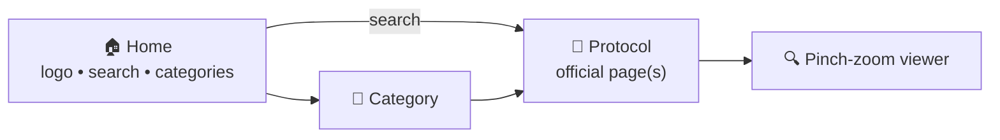

# Mulvane EMS Protocols

A fast, **offline** mobile reference for the Mulvane EMS field protocols — built to
replace the unwieldy "open the PDF and hunt for the right page on a call" workflow.
Runs on **both Android and iOS** from a single codebase.

> ⚠️ **Clinical disclaimer.** This app reproduces the Mulvane EMS Protocols document
> (effective **May 1, 2022**) as faithful page images. It is a reference convenience,
> **not** a live-updated source of truth. Always verify against current protocols and
> medical direction. This app should be reviewed and approved by medical direction
> before any field use.

---

## What it does

- **Home → Adult / Pediatric / Practices / Triage-Transport / Procedures** — large tap
  targets to pick a category.
- **Search** across all **106 protocols** by name (e.g. "chest pain", "epi", "OD") and
  jump straight to the protocol.
- **Official page images** — each protocol opens to the exact page(s) from the source
  PDF, including the algorithm flowcharts that only exist as images.
- **Pinch-to-zoom** viewer — pinch to zoom, drag to pan, double-tap to reset; Prev/Next
  for multi-page protocols.
- **Fully offline** — everything is bundled in the app; no signal required, no patient
  data leaves the device.

## Navigation at a glance



A fuller set of diagrams (architecture + content pipeline) lives in
[`docs/ARCHITECTURE.md`](docs/ARCHITECTURE.md).

---

## Tech stack

| | |
|---|---|
| Framework | **Expo** (React Native), TypeScript |
| Expo SDK | **54** (matches the public Expo Go app) |
| Gestures/animation | `react-native-gesture-handler`, `react-native-reanimated` v4 |
| Content tooling | Python + **PyMuPDF** (`scripts/render_pages.py`) |
| Backend | none — all content is bundled and offline |

## Getting started

You'll need [Node.js (LTS)](https://nodejs.org/) and the **Expo Go** app on your phone.

```bash
git clone https://github.com/GoingJu/Mulvane_EMS_Protocol_Appp.git
cd Mulvane_EMS_Protocol_Appp
npm install
npx expo start --go
```

Then scan the QR code with **Expo Go** (phone and computer on the same Wi-Fi). On a
network with device isolation, use your phone's hotspot or `npx expo start --go --tunnel`.

> After pulling new changes, run `npm install` again **only when dependencies changed**.
> If a change doesn't appear, restart with a cleared cache: `npx expo start --go -c`.

## Project structure

```
App.tsx                  App root: state-based navigation + gesture root
index.ts                 Entry point
screens/
  HomeScreen.tsx         Logo, search, category cards
  CategoryScreen.tsx     Protocol list (grouped + filterable)
  ProtocolScreen.tsx     Official page(s) + safety disclaimer
components/
  SearchBar.tsx          Reusable search field
  PageViewer.tsx         Full-screen page viewer (modal)
  ZoomableImage.tsx      Pinch / pan / double-tap zoom
data/
  protocols.ts           5 categories, 106 protocols (THE content index)
  pageMap.ts             protocol id → PDF page numbers (auto-generated)
assets/
  logo.png               Mulvane EMS logo
  pages/                 121 rendered protocol page JPEGs + index.ts (auto-generated)
scripts/
  render_pages.py        Rebuilds page images + lookup tables from the PDF
  protocol_start_pages.json  protocol id → starting PDF page (from the TOC)
source/
  Mulvane-EMS-Protocols.pdf  Source document
```

## Updating content

When a new version of the protocols PDF is issued:

1. Replace `source/Mulvane-EMS-Protocols.pdf`.
2. If page numbers shifted, update `scripts/protocol_start_pages.json`.
3. Regenerate images, lookup tables, and the search index:
   ```bash
   pip install pymupdf      # first time only
   python scripts/render_pages.py        # page images + pageMap.ts
   python scripts/build_search_index.py  # full-text search index (searchText.ts)
   ```
4. Review the diff, commit, and push. Always have medical direction confirm the content.

To add or rename a protocol or category, edit `data/protocols.ts` (and add its start
page in `scripts/protocol_start_pages.json` before re-running the script).

## Roadmap

- True in-list pinch-zoom / open-already-zoomed option
- Favorites & recently-viewed
- Proper app icon + splash from a high-resolution logo

See [`CHANGELOG.md`](CHANGELOG.md) for what's shipped so far.

## License

See [`LICENSE`](LICENSE). Protocol content © Mulvane EMS.
