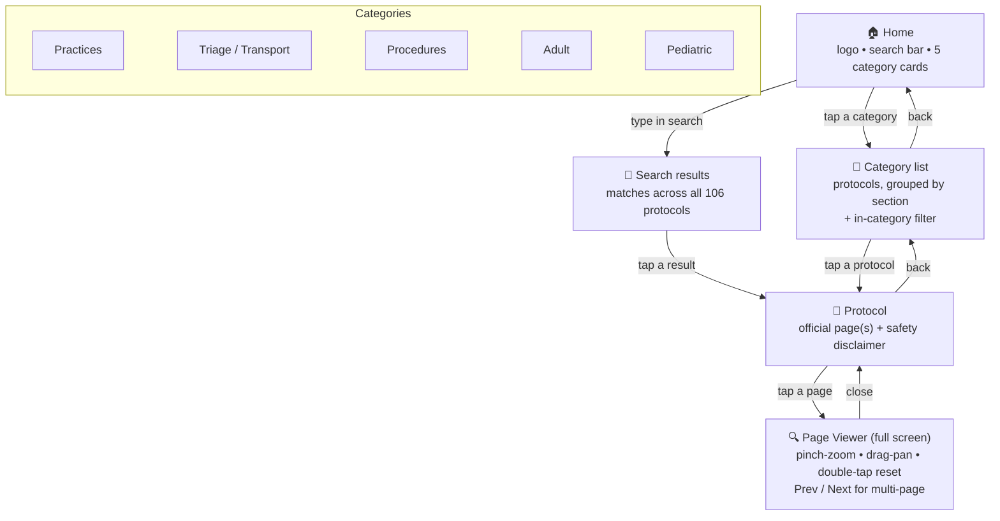
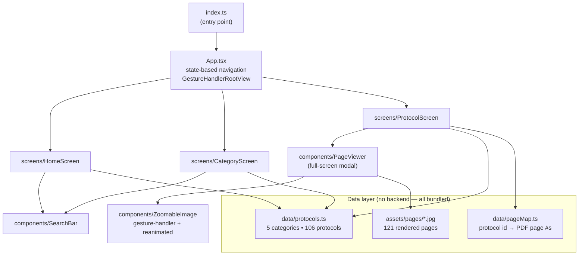
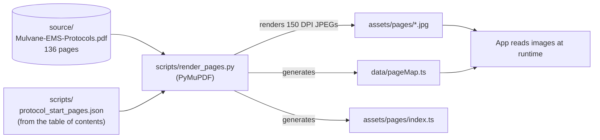

# Mulvane EMS Protocols — App Architecture

A visual overview of how the app is put together. Diagrams use [Mermaid](https://mermaid.js.org/),
which GitHub renders automatically.

---

## 1. What the user sees (navigation flow)

---

## 2. How the code is organized (component architecture)

---

## 3. How protocol content is built (offline content pipeline)

The app ships **fully offline** — every protocol is a faithful image of the official
PDF page, so it works with no signal in the field.

**To update content when the PDF changes:** drop the new PDF in `source/`, adjust
`scripts/protocol_start_pages.json` if the page numbers moved, then run
`python scripts/render_pages.py`. Section-divider pages are detected and excluded
automatically.

---

## Key design decisions

| Decision | Why |
|---|---|
| **Offline-first, content bundled in the app** | Crews are often in areas with no signal; nothing should depend on a network. |
| **Official page images, not re-typed text** | Zero transcription risk on doses/algorithms; some pages are image-only and can't be transcribed anyway. |
| **Expo (React Native)** | One codebase ships to both iOS and Android. |
| **State-based navigation (no router yet)** | Keeps the first version dependency-light; can move to Expo Router later. |
| **Expo SDK 54** | Matches the public Expo Go app so it runs without a custom native build. |

> ⚠️ **Clinical note:** the page images faithfully reproduce the protocols document
> (effective May 1, 2022). The app is a reference convenience, not a live-updated
> source of truth, and should be reviewed by medical direction before field use.
